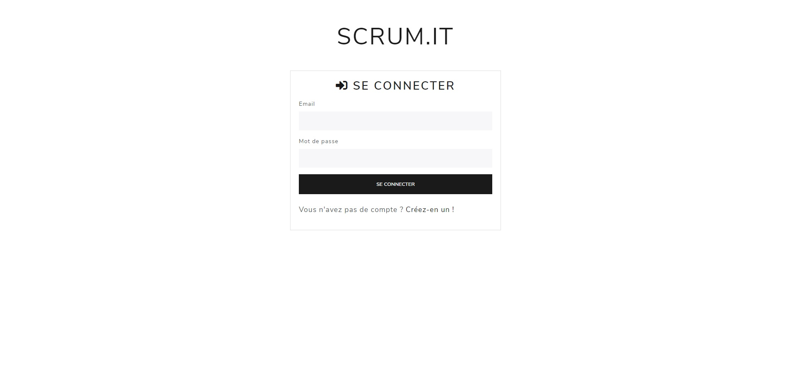
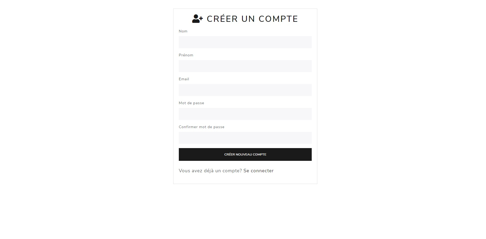
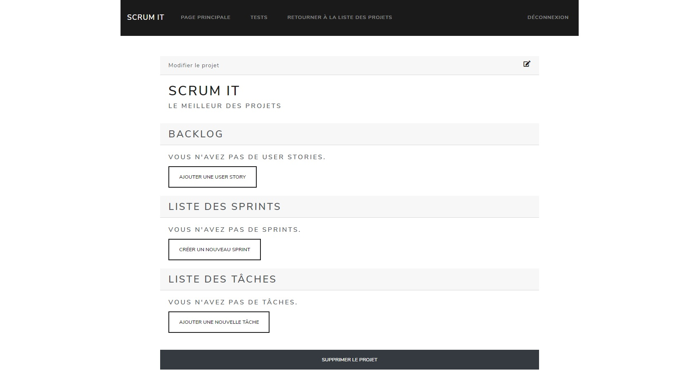
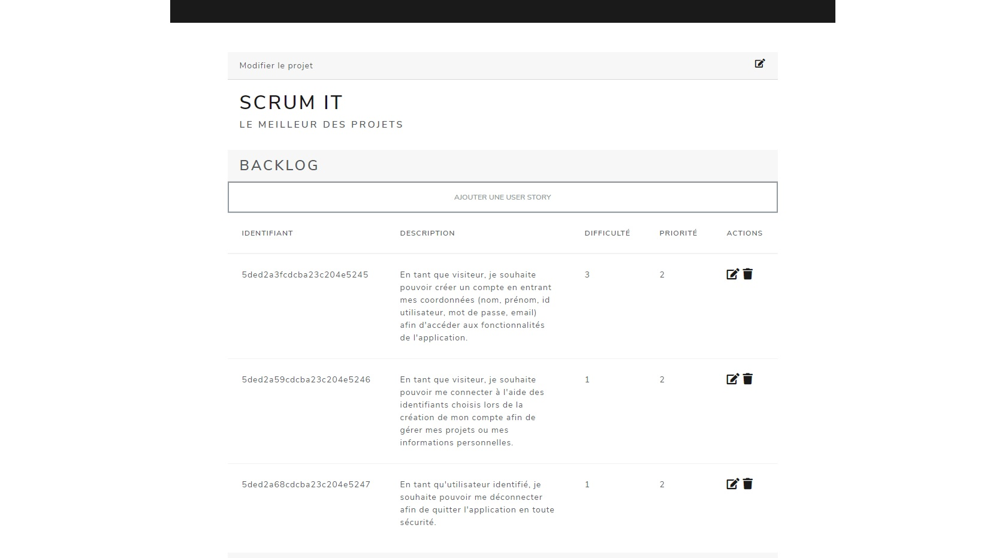

# Documentation utilisateur (v0.2.0)

## Créer un compte et se connecter

La première page que vous verrez en accédant au site est la page de connexion. 

Vous aurez besoin d'un compte pour vous connecter. Cliquer sur "Créez-en un !" vous amènera à la page de création de compte.

Une fois avoir rempli le formulaire et créer votre compte, vous pourrez vous connecter avec l'email et le mot de passe que vous avez défini lors de la création du compte.
Une fois connecté, vous arriverez sur la page d'accueil, listant tous les projets auxquels vous contribuez.

## Se déconnecter

Depuis la page d'accueil, cliquez sur l'icône  à droite de la page pour vous déconnecter.

## Créer un projet

Depuis la page d'accueil, il vous suffira de cliquer sur le bouton "Créer projet" puis de remplir le formulaire pour créer votre projet.
Vous serez ensuite rediriger vers la page d'accueil et votre projet nouvellement créé sera ajouté à la liste des projets.

## Ajouter un contributeur

Les autres utilisateurs ne peuvent pas voir les projets que vous créez. Pour qu'ils puissent y accéder et le modifier, vous pouvez ajouter un contributeur.
Pour cela, il suffit de cliquer sur l'icône  qui est sur la même ligne que votre projet.
Vous pourrez ensuite ajouter un contributeur en entrant son email. Notez que la personne que vous voulez ajouter doit posséder un compte.

## Modifier un projet

Vous pouvez modifier le nom et la description d'un projet en cliquant sur l'icône  qui est sur la même ligne que le projet que vous souhaitez modifier. Cela vous redirigera vers la page de modification et vous pourrez facilement changer le nom et/ou la description de votre projet. 
Vous pouvez également modifier un projet depuis la page principale du projet, en cliquant sur l'icône  en haut de la page, au-dessus du nom du projet.

## Supprimer un projet

Depuis la page d'accueil, vous pouvez facilement supprimer un projet en cliquant sur l'icône  qui est sur la même ligne que le projet que vous souhaitez supprimer. 
Vous pouvez également supprimer un projet depuis la page principale du projet, en cliquant sur le bouton "Supprimer le projet" en bas de la page.

## Accéder à la page principale d'un projet

Vous pouvez accéder à la page principale d'un projet en cliquant sur le nom de ce dernier dans la liste des projets, dans la page d'accueil.

## Ajouter une user story

Depuis la page principale du projet, cliquer sur le bouton "Ajouter une user story" dans la section "Backlog". Vous pourrez ensuite remplir le formulaire et cliquer sur "Ajouter une user story" pour ajouter votre nouvel user story au backlog de votre projet.

## Supprimer une user story

Depuis le backlog de la page principale du projet, vous pouvez facilement supprimer une user story en cliquant sur l'icône  qui est sur la même ligne que la user story que vous souhaitez supprimer.

## Créer un sprint

Depuis la page principale du projet, vous pouvez créer un nouveau sprint en cliquant sur le bouton "Créer un nouveau sprint" dans la section "Sprints".
Vous pourrez ensuite remplir le formulaire de création et cliquer sur "Créer un sprint" pour créer votre sprint.

## Modifier un sprint

Depuis la page principale du projet, vous pouvez modifier un sprint en cliquant sur l'icône , à côté du nom du sprint que vous souhaitez modifier.
Vous pourrez ensuite remplir le formulaire de modification et cliquer sur "Modifier le sprint" pour appliquer les modifications.

## Supprimer un sprint

Depuis la page principale du projet, vous pouvez modifier un sprint en cliquant sur l'icône , à côté du nom du sprint que vous souhaitez supprimer.

## Ajouter une user story à un sprint

Depuis la page principale du projet, vous pouvez ajouter une user story à un sprint en cliquant sur le bouton "Ajouter des user stories" dans la section de votre sprint.
Vous pourrez ensuite sélectionner les user stories que vous souhaitez rajouter à votre sprint, puis cliquer sur "Ajouter les user stories sélectionnées" pour les ajouter au sprint.  

Notez qu'une user story ne peut appartenir qu'à un sprint à la fois. Si vous vous êtes trompé et avez ajouté la user story au mauvais sprint, vous devrez la retirer du mauvais sprint avant de pouvoir l'ajouter au bon sprint.

## Modifier une user story

Depuis la page principale du projet, vous pouvez modifier une user story depuis le backlog en cliquant sur l'icône  qui est sur la même ligne que la user story que vous souhaitez modifier.  
Vous pouvez également modifier une user story depuis le sprint où elle est affectée de la même manière que ci-dessus.

## Enlever une user story d'un sprint

Depuis la page principale du projet, vous pouvez retirer une user story d'un sprint en cliquant sur l'icône  qui est sur la même ligne que la user story que vous souhaitez retirer.

### *TODO: les tâches*

